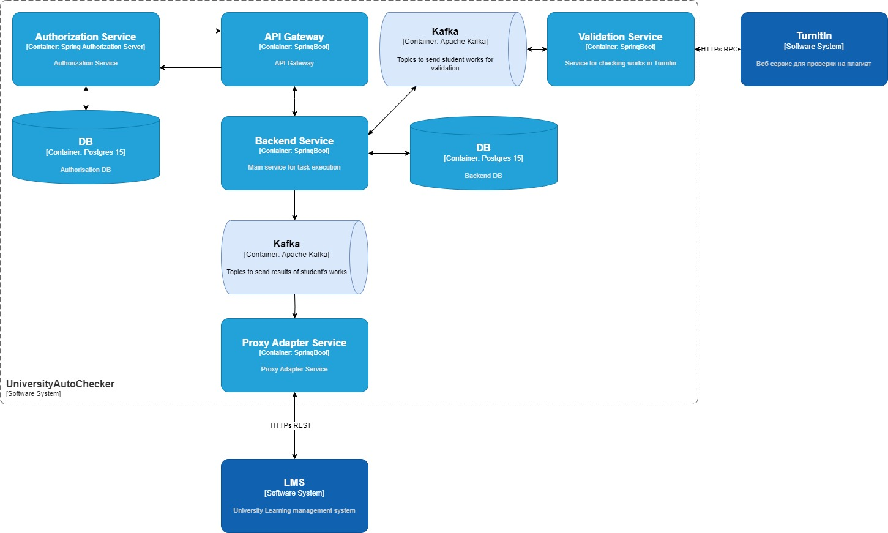
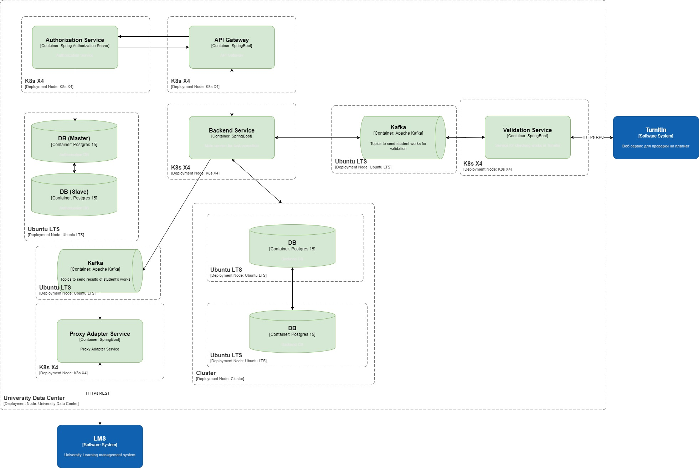

## 
Разработка архитектурного решения для системы автоматической оценки заданий по программированию (для Университета)

#[Check your work/Проверьте свою работу](https://nealford.com/katas/kata?id=CheckYourWork)

## Бизнес контекст
Университет значительно расширил свой курс информатики и хочет иметь возможность автоматизировать оценку простых заданий по программированию.

**Пользователи**: 
- более 300 студентов в год, плюс персонал (профессора/преподователи) и администратор.

**Требования**:
- cтуденты должны иметь возможность загружать свой исходный код, который будет запущен и оценен.
Оценки и прогоны должны быть постоянными и поддающимися проверке.

- необходимая система обнаружения плагиата, включающая сравнение с другими представленными материалами, а также отправку в веб-службу (TurnItIn).

- необходима интеграция с системой управления обучением университета (LMS)

- профессор устанавливает дату и время сдачи, после чего заявки отклоняются

- учащиеся могут отправлять столько попыток, сколько хотят чтобы улучшить свою оценку

- преподаватели определяют критерии оценки, которые могут включать показатели и/или тесты

**Дополнительный контекст**:
- Университетская система управления обучением (LMS) основана на мэйнфрейме, и в нее довольно сложно вносить изменения.
оценки ежегодно проверяются государственным регулирующим органом.

- У университета очень мало бюджета на ИТ, поскольку он строит запасной стадион для SportsBall.

- Университет является рекордсменом по количеству самых успешных выпускников CS в стране.
## Бизнес-цели и бизнес-драйверы

### Бизнес-драйверы:

- ручная/полу-ручная проверка заданий по программированию занимает слишком много времени, требует много времени преподователей. 

- отсутсвие автоматизации и стандартных, одинаковых критериев проверки для всех вызывает недовольство студентов. 

- отсутствие централизованной цифровой платформы для проверки заданий, плохо сказывается на имидже университета (как топ университета в сфере CS)

### Бизнес цели
С минимальным бюджетом разработать надежную систему автоматизации проверки заданий по программированию. Важно учесть невозможность / дороговизну изменений в Университетскую систему управления обучением (LMS) основанную на мэйнфрейме

## Стейкхолдеры и их потребности
Заинтересованные стороны, ключевые участники:
- cтудент - студент университета , который загружает выполненные задания на проверку
- профессор/преподователь - сотрудник университета, формирующий задания и условия их проверки/тесты , а так же определяющий сроки сдачи (срок до которого студент может загружать исходный код)
- администратор - человек, который осуществляет администрирование системы, выдает уз и права пользователям.
- представитель заказчика со стороны университета - человек/группа людей отвечающая за расходование бюджета и приемку проекта

Потребности:
- снижение издержек на проверку заданий(трудозатрат на ручную проверку) за счет автоматизации 
- повышения качества проверки за счет автоматизации и доп проверки на антиплагиат
- повышение престижа университета за счет создания и внедрения автоматической системы учета заданий
- необходимость уложится в бюджет
- необходимость по возможности избежать изменений в мэйнфрейме

## Пользовательские истории
Us-0: Заведение заданий в систему:
- Сотрудник университета, заходя в приложение, указывает условие задания, критерии корректно выполненного задания (автотесты) и дату до которой студент может загрузить решение
- так же указывает группу студентов для которых предназначается задание
- сотрудник может загрузить проверочный исходный код и посмотреть результаты оценки.

Us-1: Выдача уз пользователям:
- Администратор, заходя в приложение, создает уз для сотрудников университета и студентов (с соответсвующими ролями)

Us-2: Загрузка выполненного задания:
- студенты, заходя в приложение, видя назначенные на них задания могут загрузить исходный код выполненного задания (с указанием яп)
- исходный код проверяется на плагиат с другими работами студентов и отправляется в веб-службу (TurnItIn).

Us-3: Отображение заданий/оценок:
- студенты, заходя в приложение, видят детализацию (результат проверки, оценки, статус завершенно/активно/невыполненно) по назначенным на них заданиям
- сотрудник , заходя в приложение, видит все созданные им задания и детальную историю по ним (каждую загрузку исходного кода по заданию с результатами)

## [Контекстная схема](../July/c4Context.puml)

## Критичные сценарии и критичные характеристики
**Критичные сценарии**:
- сотрудник университета создает задания и назначает их студентам
- сотрудник университета видит результаты студентов по заданиям
- студенты загружают исходный код
- студенты видят свои оценки и результат прогона кода по заданиям

**Критичные характеристики**:
- стоимость разработки 
- доступность системы и базы данных
- надежность: не должно быть потерь по истории прогонов заданий , однажды выставленная оценка/полученный результат не должен теряться/меняться
- система должна интегрироваться с существующей в университетской системой управления обучением (LMS) основанную на мэйнфрейме (без или с минимальными изменениями в последнй)

Из них можно выделить три важных характеристики:
- стоимость разработки 
- надежность
- система должна интегрироваться с существующей в университетской системой управления обучением (LMS) основанную на мэйнфрейме (без или с минимальными изменениями в последнй)

## Архитектурное решение. Альтернативы
На основании контекста и бизнес сценария сфокусируемся на тех альтернативах, 
которые сильнее всего влияют на стоимость разработки  и надежность (учитывая что необходимо интеграция с мейнфреймом(LMS)):
1. Готовое облачное решение пример [codehs](https://codehs.com)
2. собственная система с приложениями, написанными под текущие требования

### Архитектурное решение 1.
Готовое облачное решение

Стоимость разработки :
- требуется постоянная подписка , что может быть неприемлимо для университета.

Надежность:
- надежность гарантируется вендором, необходимо уточнить какие SLA он гарантирует

Возможность интеграции с университетским мейнфреймом(LMS):
- скорее всего нужно будет дорабатывать и писать некий proxy-adapter

### Архитектурное решение 2.
Собственная система с приложениями, написанными под текущие требования

Стоимость разработки:
- capex затраты будут однозначно выше чем в случае с готовым облачным решением, зато opex скорее всего ниже

Надежность:
- тут есть возможность самим выставлять SLA к системе 

Возможность интеграции с университетским мейнфреймом(LMS):
- так как разработка под заказ то с этим проблем быть не должно.

## Сравнительная оценка альтернатив
В целом , видится что решение с собственной разработкой более предпочтительно так как дает большую гибкость , но тут для принятия взвешенного решения необходимо провести доп исследование/консультации с университетом:
- Что более предпочтительно для университета разовые затраты capex или постоянные opex (на подписку)
- Узнать какие SLA предлагает вендор, есть ли возможность доработаться и интегрироваться с университетским мейнфреймом(LMS)

## Описание решения

**Контекстная диаграмма С1**
**Диаграмма контейнеров С2**
**Диаграмма развертывания**
**ER диаграмма слоя данных**

## Сценарии
### Просмотр (получения) списка задач

### Просмотр (получения) списка работ

### Cоздание задачи/Редактирование задачи

#### Оценка атрибутов качества

Для всех 3х сценариев выше выбрано простейшее решение через REST API и синхронное взаимодействие.

Надежность: 
Сценарии сбоев
- отказ API proxy
- долгий ответ бэка

Можно купировать через техники балансировки; graceful Degradation; progressive Enhancement; throttling; retry&timeout;)

Производительность: 
- узкое место в БД
- узкое место в сети

Можно решить через создание реплик master/slave, балансировкой

Модифицируемость: 
- изменение фильтров поиска на UI
тут ось изменений пройдет через API Proxy и User service
- изменения на стороне бэка
изменения затронут только backend service

### Создание работы

### Редактирование работы

#### Оценка атрибутов качества

2 сценария выше реализованны чуть сложнее, добавляется обьектное хранилище так как предпологается что выполненная работа может занимать много места и в связи с возможными ограничениями сети ее необходимо хранить в файлом хранилище

Надежность: 
Сценарии сбоев
все те же что и выше + возможные проблемы с сервисом файлового хранилища

Производительность: 
- узкое место в БД
- узкое место в сети

Можно решить через создание реплик master/slave, балансировкой

Модифицируемость: 
- изменение фильтров поиска на UI
тут ось изменений пройдет через API Proxy и User service
- изменения на стороне бэка
изменения затронут только backend service