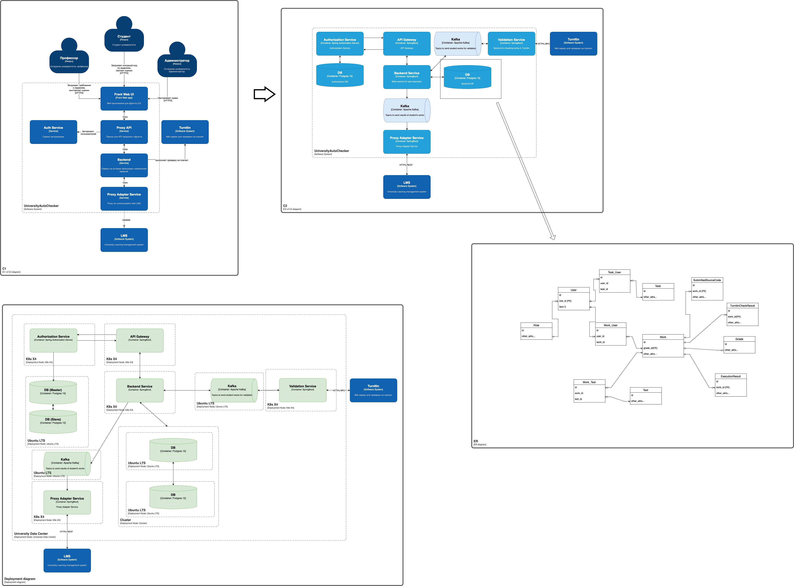

## Внимание

В данной работе сделана попытка подготовить С4 диаграмму на уровнях С1/С2, расписать ER диаграму для сущностей слоя данных и подготовить deployment диаграмму.
Бизнес контекст задачи был рассмотрен ([тут](../July/homework.md)).\
Функциональная декомпозиция ([тут](../SecondHomeWork/homework.md)).\
Взаимодействие сервисов ([тут](../ThirdHomeWork/homework.md)).
## Итоговые диаграммы
