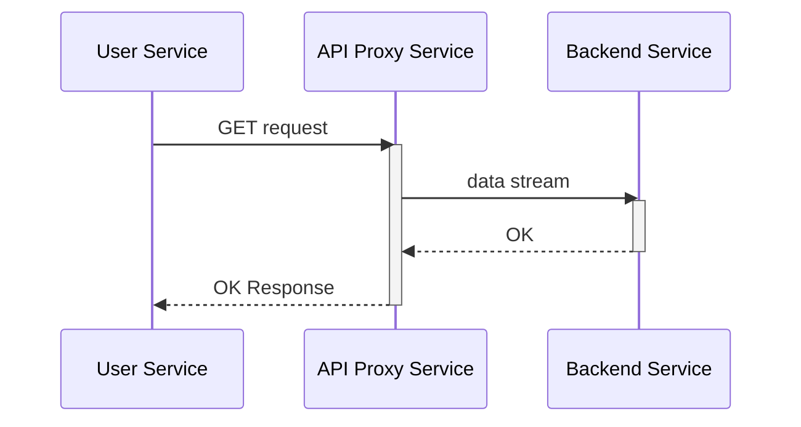
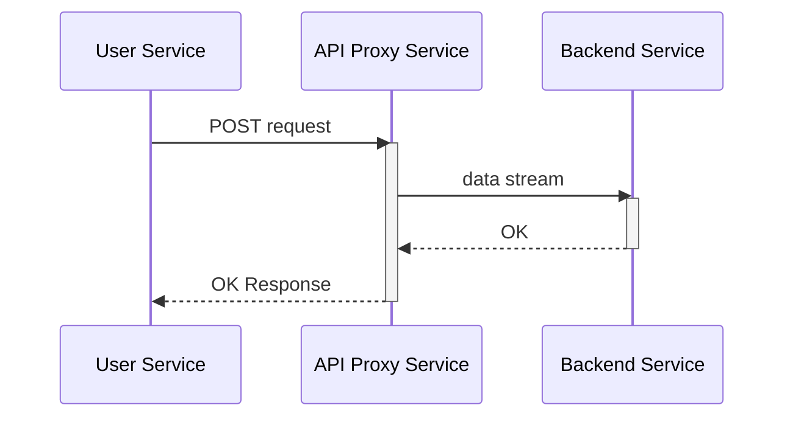
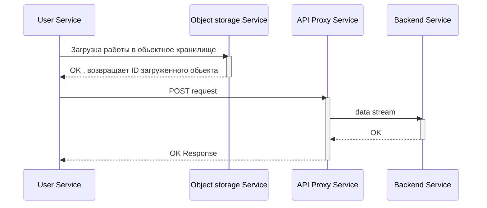
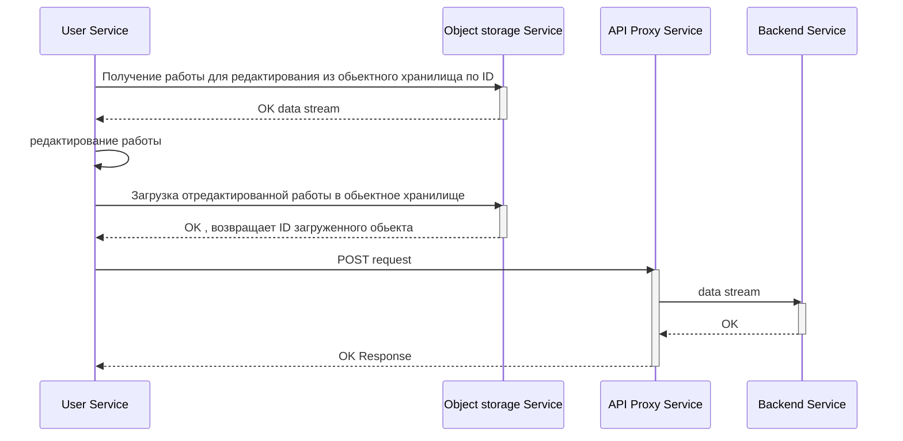

## Внимание

В данной работе сделана попытка описать взаимодействие нескольких сервисов и оценить архитектурное решение.
Для критичного сценария. Бизнес контекст был рассмотрен ([тут](../July/homework.md)).\
Функциональная декомпозиция ([тут](../SecondHomeWork/homework.md)).\
Сервисы будут описаны в рамках выбранного основного контекста пользователя.
## Сценарии
### Просмотр (получения) списка задач

### Просмотр (получения) списка работ

### Cоздание задачи/Редактирование задачи

#### Оценка атрибутов качества

Для всех 3х сценариев выше выбрано простейшее решение через REST API и синхронное взаимодействие.

Надежность: 
Сценарии сбоев
- отказ API proxy
- долгий ответ бэка

Можно купировать через техники балансировки; graceful Degradation; progressive Enhancement; throttling; retry&timeout;)

Производительность: 
- узкое место в БД
- узкое место в сети

Можно решить через создание реплик master/slave, балансировкой

Модифицируемость: 
- изменение фильтров поиска на UI
тут ось изменений пройдет через API Proxy и User service
- изменения на стороне бэка
изменения затронут только backend service

### Создание работы

### Редактирование работы

#### Оценка атрибутов качества

2 сценария выше реализованны чуть сложнее, добавляется обьектное хранилище так как предпологается что выполненная работа может занимать много места и в связи с возможными ограничениями сети ее необходимо хранить в файлом хранилище

Надежность: 
Сценарии сбоев
все те же что и выше + возможные проблемы с сервисом файлового хранилища

Производительность: 
- узкое место в БД
- узкое место в сети

Можно решить через создание реплик master/slave, балансировкой

Модифицируемость: 
- изменение фильтров поиска на UI
тут ось изменений пройдет через API Proxy и User service
- изменения на стороне бэка
изменения затронут только backend service