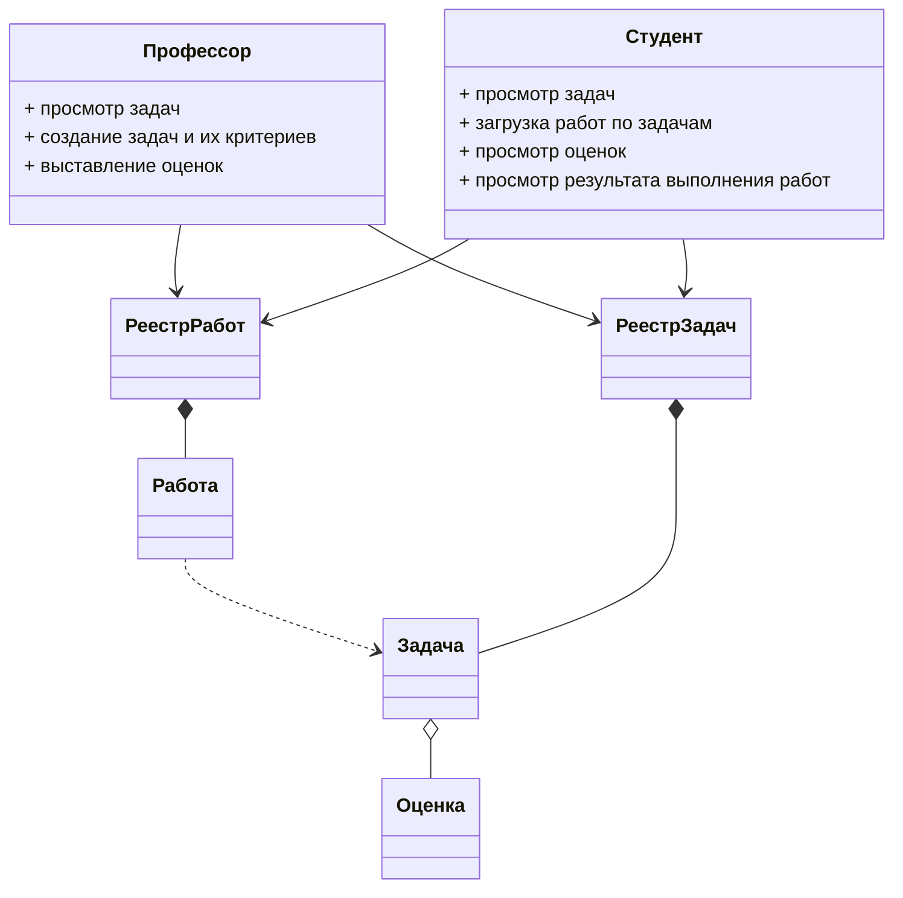
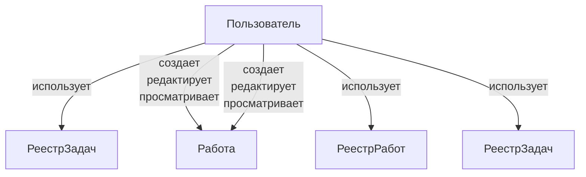
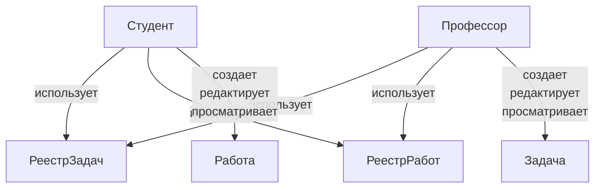

## Внимание

В данной работе выполнена функциональная декомпозиция для бизнес кейса, который уже был рассмотрен ранее ([тут](../July/homework.md)).\
Было найдено два архитектурных решения, одно из которых предполагает разработку системы с нуля.\
На нем и будет сконцентрирована данная ADR.

## Модели предметной области

В модели предметной области выделены следующие сущности:

## Функциональная декомпозиция #0
Можно обьединить две роли (Студент и Профессор) в одну роль пользователя.\
Оба взаимодействуют как с РеестромРабот так и Реестром Задач, есть общий функционал на просмотр задач/работ, отличие в правах можно разграничиваеть правами доступа.\

Контекст по итогу будет выглядеть так:
- контекст пользователя

## Функциональная декомпозиция #1
Первый вариант хорош так как проще в реализации и может быть реализован за более короткий промежуток времени\
Кажется что с точки зрения модифицируемости может быть хорошим вариантом разделить контексты Студента и Профессор\
Однако из диаграммы ниже видно что это приведет к большому дублированию функциональности и потенциально кода\
Проблему конечно можно решить за счет выделения некой общей части но это увеличит трудозатраты как по разработке так и по поддержанию системы

Контекст по итогу будет выглядеть так:
- контекст Студента
- контекст Профессора

## Сценарии изменений

- Добавление новых языков программирования для задач [вероятность - высокая]
- Добавление новых критериев оценки [вероятность - высокая]
- Изменения UI взаимодействия студентов и профессаров [вероятность - средняя]

## Сравнительный анализ
Для всех намеченных сценариев изменения - вариант декомпозиции #0 предпочтительнее, так как выделение различных контекстов (Студент, Профессор), не дают никаких преимуществ по модифицируемости , ось изменения во всех случаях затрагивает и контекст Студент, и контекст Профессор при этом реализация и поддержка решения будут более трудозатратными.